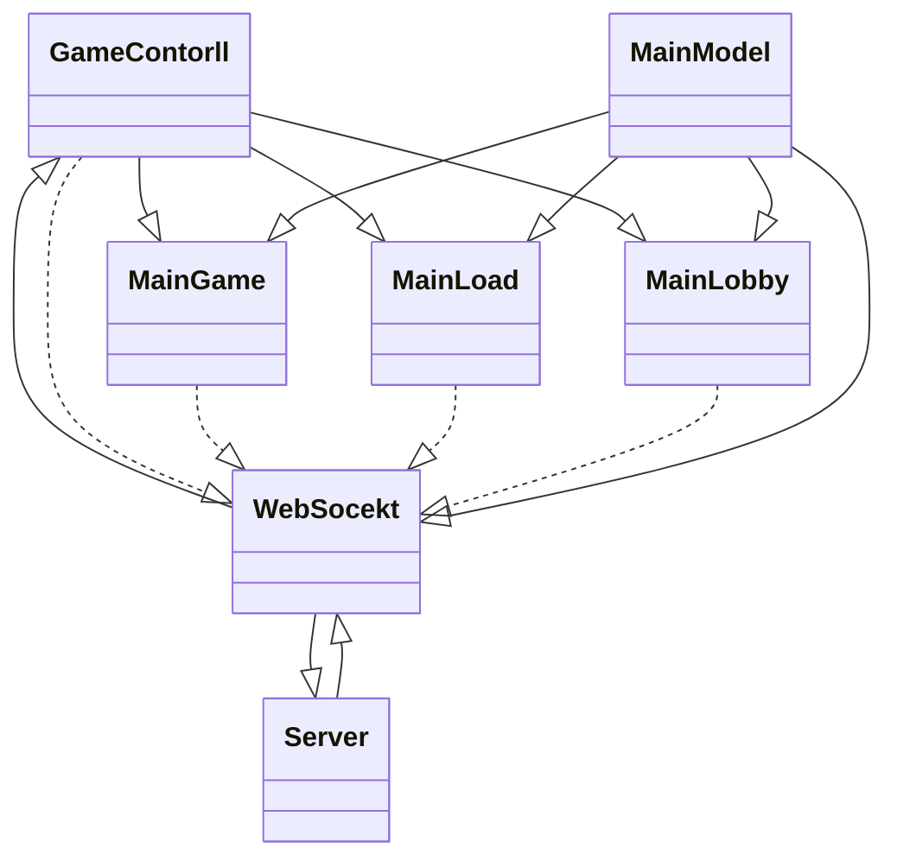

# 結構圖

```mermaid
classDiagram
WebSocekt --|> Server
WebSocekt <|-- Server
GameContorll <|-- WebSocekt
GameContorll ..|> WebSocekt
MainGame ..|> WebSocekt
MainLoad ..|> WebSocekt
MainLobby ..|> WebSocekt
GameContorll --|> MainGame
GameContorll --|> MainLobby
GameContorll --|> MainLoad
MainModel --|>  MainGame 
MainModel --|>  MainLoad 
MainModel --|>  MainLobby 
MainModel --|>  WebSocekt 


class Server
class WebSocekt
class MainModel
class GameContorll
class MainLoad
class MainLobby
class MainGame
```

